# AniDream

🌟 Welcome to the AniDream Repository! 🌟 

We are excited to share the official repository for **"AniDream: Generating Skeleton-Guided Anime Avatars from Text Prompts"**


🚀 Exciting News! 🚀

**AniDream has been accepted for presentation at [IEEE ISMAR 2025](https://ieeeismar.org/)!** 

💡 Title: AniDream: Generating Skeleton-Guided Anime Avatars from Text Prompts

👩‍💻 Authors: Fernanda Miyuki Yamada, Hiroki Takahashi

🎓 Conference: IEEE International Symposium on Mixed and Augmented Reality (ISMAR 2025)

---


🧠✨ **Training code will be available soon! Stay tuned for updates.** ✨🧠

---

## Abstract

Generating high-quality anime avatars has become an increasingly important task in the fields of animation, gaming, and virtual reality. However, existing frameworks often face challenges in achieving anatomical consistency and mitigating visual artifacts. To address these limitations, we introduce AniDream, a novel framework designed for the generation of high-quality anime avatars. Unlike previous approaches that primarily relied on image-based inputs, AniDream incorporates text-guided generation, allowing users to create diverse anime avatars directly from text prompts. AniDream uses a skeleton-guided approach, ensuring anatomical consistency while focusing on refining attention around key regions. Our framework introduces a novel loss function that simulates a cel-shading effect and encourages the generated avatars to maintain sharp contour definitions and shadowing consistent with anime aesthetics. Experiments show that AniDream outperforms other frameworks by reducing artifacts and maintaining visual consistency across various poses and viewpoints. It also achieves an average CLIPScore of 33.07, demonstrating its effectiveness in closely aligning generated avatars with text prompts.

**keywords: anime, avatar, diffusion model, generative model, text-to-image, low-rank adaptation, cel-shading.**

## Workflow
AniDream takes a **text prompt** and processes it using a diffusion model guided by skeleton keypoints extracted from **SMPL-X** to ensure anatomical accuracy. It uses a **LoRA** module fine-tuned on anime-style data to adapt the generation style to the anime domain. A **cel-shading-inspired loss** refines the output to produce crisp contours and flat shading consistent with anime aesthetics.

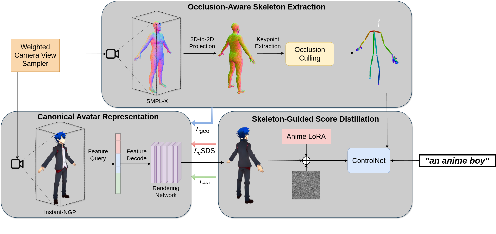

## Video
The following video is a compressed preview.  
For the full-resolution supplementary video, please [download it here](assets/demo_video.mp4).

[Watch Compressed Preview](https://github.com/user-attachments/assets/3a6b217c-2180-4f48-afaf-3164f0c2f1bc)

<!-- 
## Getting Started

### Core Requirements

- Python 3.11.10
- PyTorch 2.1.0  
- CUDA 11.8  

### Installation

```bash
git clone https://github.com/fernandamyamada1/AniDream.git
cd AniDream
pip install -r requirements.txt
```

### Usage
```
bash scripts/anime_ismar.sh "an anime boy"
```
-->

## Results

Here are example outputs generated by AniDream based on different descriptive text prompts. The outputs display diverse anime-style avatars, capturing fine-grained details from each description. AniDream can create visually consistent and expressive characters with strong alignment to textual input.

<table align="center">
  <tr>
    <td align="center" style="padding: 10px;">
      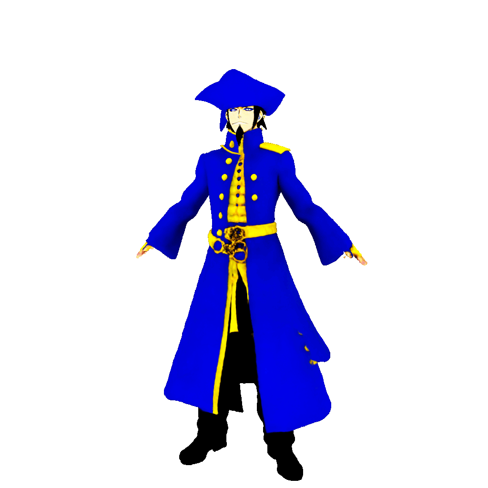<br/>
      <sub><i>"an anime pirate in a blue and gold coat"</i></sub>
    </td>
    <td align="center" style="padding: 10px;">
      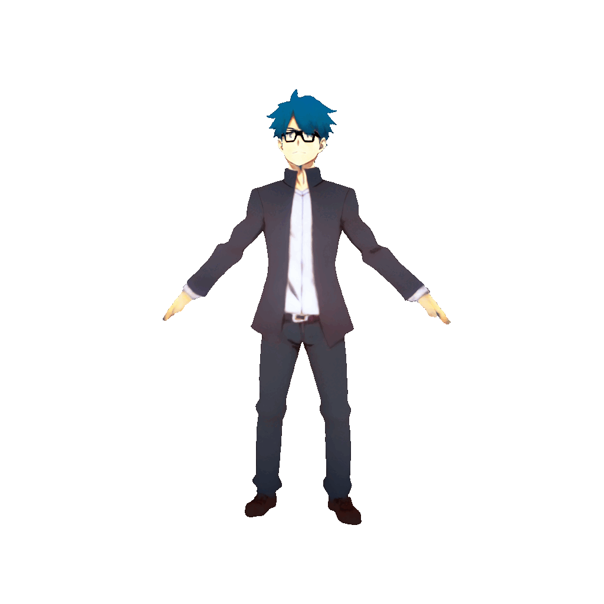<br/>
      <sub><i>"an anime boy with glasses"</i></sub>
    </td>
    <td align="center" style="padding: 10px;">
      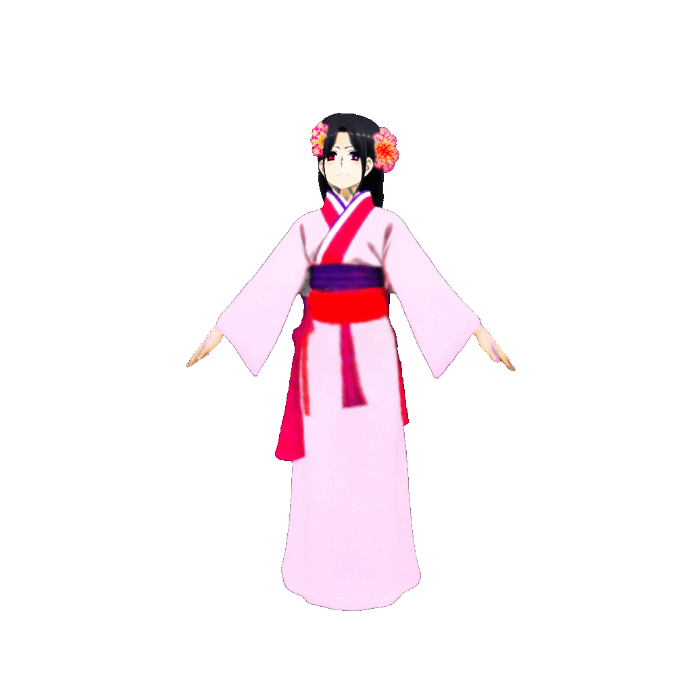<br/>
      <sub><i>"an anime girl in a kimono"</i></sub>
    </td>
  </tr>
  <tr>
    <td align="center" style="padding: 10px;">
      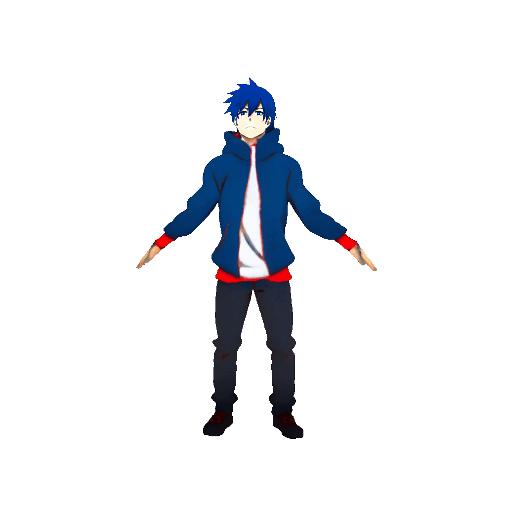<br/>
      <sub><i>"an anime boy in a hoodie"</i></sub>
    </td>
    <td align="center" style="padding: 10px;">
      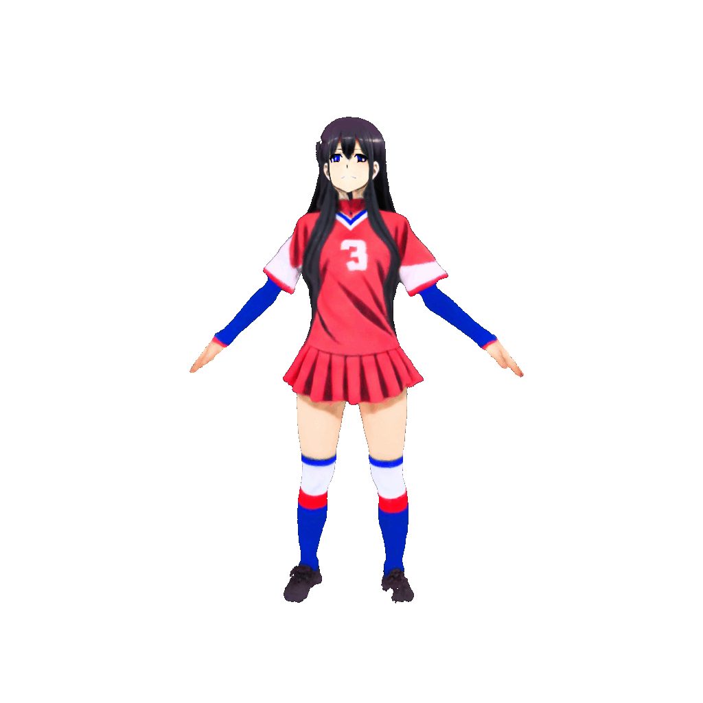<br/>
      <sub><i>"an anime girl in a sports jersey"</i></sub>
    </td>
    <td align="center" style="padding: 10px;">
      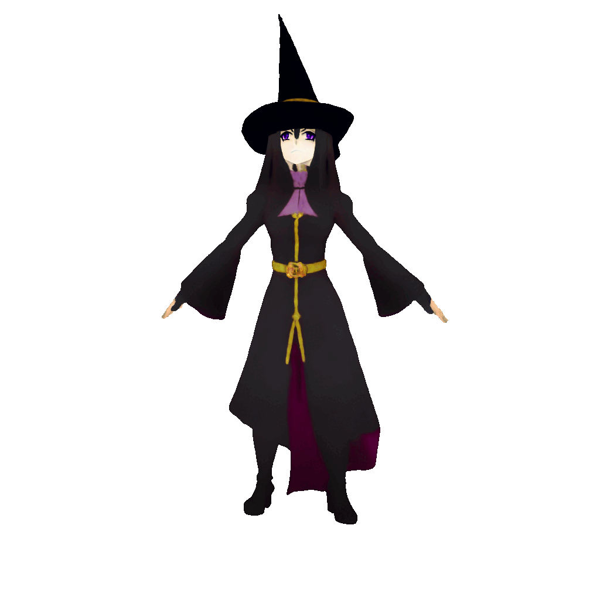<br/>
      <sub><i>"an anime witch with pointy hat"</i></sub>
    </td>
  </tr>
</table>


### Generation Across Epochs

This animation demonstrates how the generated character evolves during training epochs, showing improvements and refinement in the output quality over time.

<p align="center">
 
</p>


### Normal Map

The following shows a single sample normal map generated for the prompt *"an anime boy"*.  Normal maps capture detailed surface geometry and shading cues, which are important for realistic lighting and 3D rendering.


<table align="center">
  <tr>
    <td align="center" style="padding: 10px;">
      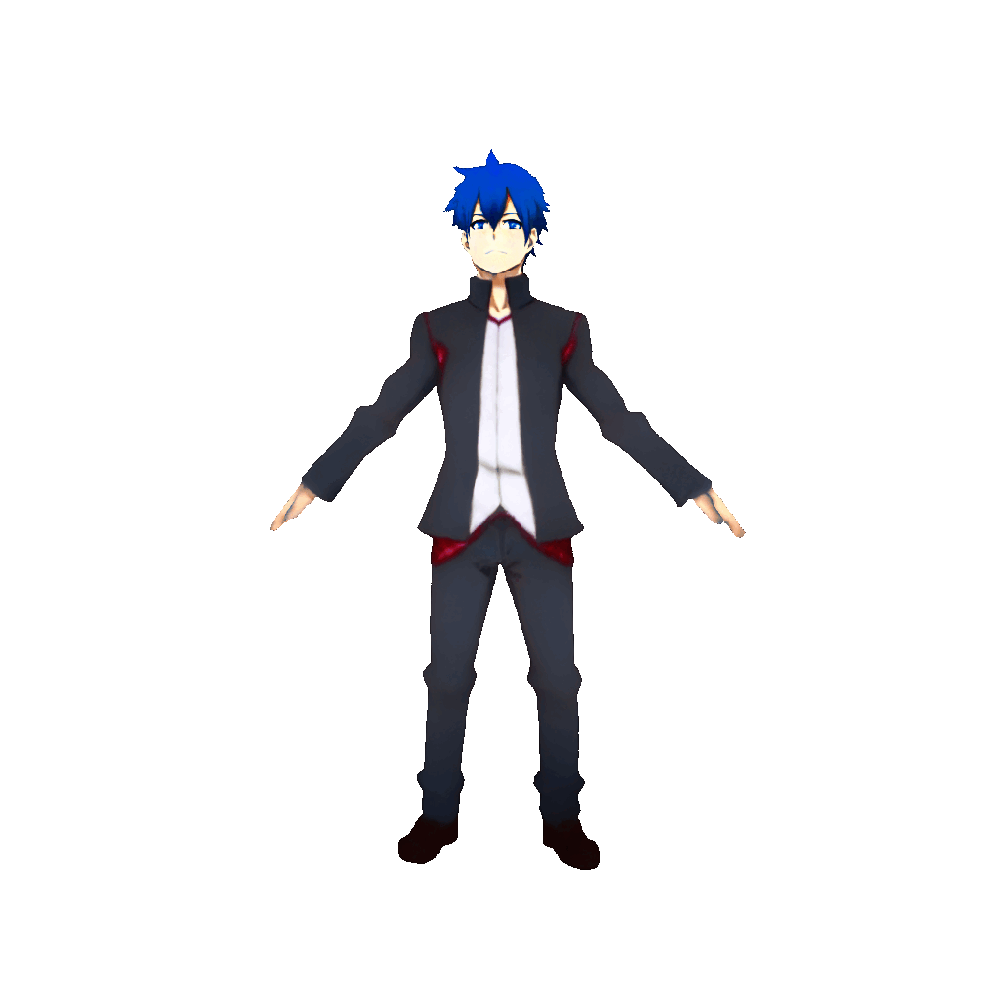<br/>
      <sub><i>Avatar</i></sub>
    </td>
    <td align="center" style="padding: 10px;">
      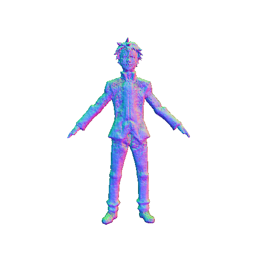<br/>
      <sub><i>Normal Map</i></sub>
    </td>
  </tr>
</table>

### Animation

This animation shows an avatar performing kung-fu movements. The movements come from an actor in the original video, from which keypoints are extracted. These keypoints are then used to render the avatar, demonstrating how the model animates characters based on real human motion.

<p align="center">
 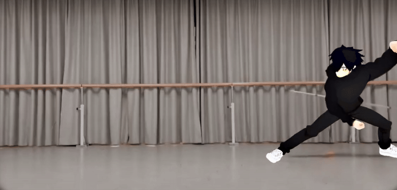
</p>

<p align="center" style="font-size: small; margin-top: 10px;">
  The original video sample for this animation comes from: <a href="https://github.com/IDEA-Research/Motion-X" target="_blank">github.com/IDEA-Research/Motion-X</a>
</p>

### 3D Printing

We provide a few simplified avatar models in STL format, ready for 3D printing. These files are optimized for standard consumer 3D printers and preserve key avatar features. Feel free to download and print them.

<table align="center">
  <tr>
    <td align="center" style="padding: 10px;">
      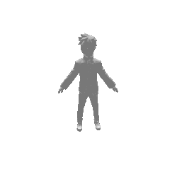<br/>
      <sub><i>"an anime boy"</i></sub><br/>
      <a href="assets/boy.stl" download>Download</a>
    </td>
    <td align="center" style="padding: 10px;">
      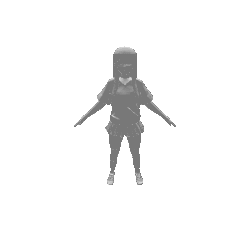<br/>
      <sub><i>"an anime girl in a sports jersey"</i></sub><br/>
      <a href="assets/jersey.stl" download>Download</a>
    </td>
  </tr>
</table>


<!-- 
## Applications in Industry

While AniDream was initially developed for immersive AR/VR and gaming experiences, its potential extends far beyond these domains. We demonstrate the versatility of AniDream avatars across several core commercial segments of manga and anime production:

<table align="center">
  <tr>
    <td align="center" style="padding: 10px;">
      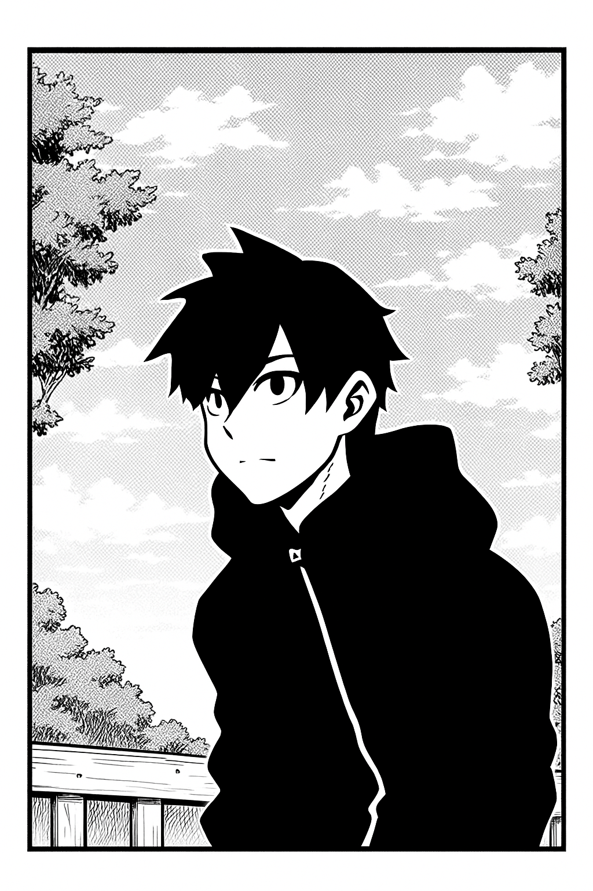<br/>
      <sub><i>Manga Panel Generation</i></sub><br/>
    </td>
    <td align="center" style="padding: 10px;">
      <br/>
      <sub><i>Anime-style Animation</i></sub><br/>
    </td>
    <td align="center" style="padding: 10px;">
      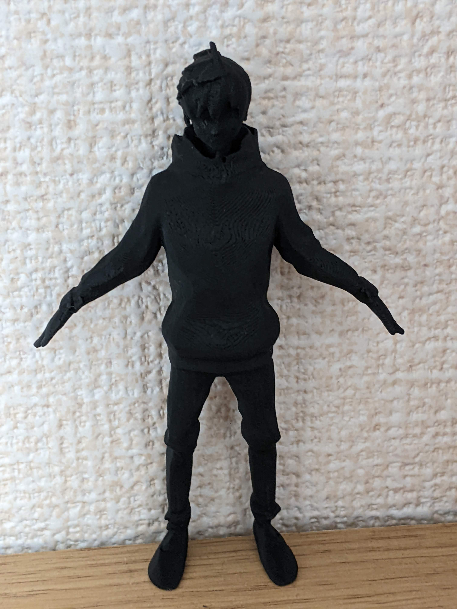<br/>
      <sub><i>Merchandise Production</i></sub><br/>
    </td>
  </tr>
</table>

<p align="center" style="font-size: small; margin-top: 10px;">
  The original motion sample for this animation comes from: <a href="https://github.com/google/aistplusplus_api" target="_blank">github.com/google/aistplusplus_api</a>
</p>

- **Manga Panel Generation**  
  A low-resolution render of a generated avatar is processed into black-and-white and passed to GPT-4o with a prompt such as *"Generate a background for this anime art. Like a manga panel."* This results in stylized manga layouts with character integration.

- **Anime-style Animation**  
  Using motion data, the avatars can be animated and composited into anime-style backgrounds. We can control body gestures frame-by-frame, apply real-world motions like dancing or walking, and ensure consistency between static design and animated behavior.

- **Merchandise Production**  
  AniDream avatars can be exported to STL format and 3D printed. This enables direct translation of digital characters into tangible merchandise products, such as action figures.

These demonstrations highlight the capacity of AniDream to support **cross-medium consistency**, ensuring that the same avatar design can be maintained across visual storytelling, animation, and physical products.

### Supported Content Production Segments

AniDream provides tools and outputs that align with the following industry segments:

- Manga Creation  
- Anime-style Animation  
- Merchandise Production  
- Augmented and Virtual Reality  
- Gaming and Interactive Media  
- Metaverse and Social Platforms
---

-->
## Acknowledgments

🔧 This work was supported by the Industrial Technology Innovation Program (Project No. 20023347: *Development of Graph-based Intelligent Metaverse Engine for Immersive Content-sharing Service*) funded by the Ministry of Trade, Industry & Energy of the Republic of Korea.

✨ We gratefully acknowledge the authors of [DreamWaltz-G](https://github.com/Yukun-Huang/DreamWaltz-G). Their framework provided the foundation and inspiration for AniDream, particularly in its skeleton-guided diffusion pipeline and avatar animation capabilities.

## Citation
```
@inproceedings{yamada2025anidream,
  title     = {AniDream: Generating Skeleton-Guided Anime Avatars from Text Prompts},
  author    = {Fernanda Miyuki Yamada and Hiroki Takahashi},
  booktitle = {IEEE International Symposium on Mixed and Augmented Reality (ISMAR)},
  year      = {2025}
}
```

