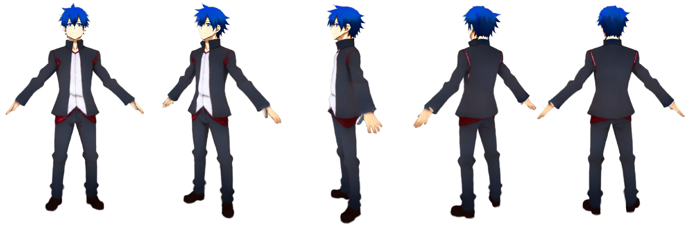

# AniDream: Generating Skeleton-Guided Anime Avatars from Text Prompts



 ## News

**AniDream has been accepted for presentation at [IEEE ISMAR 2025](https://ieeeismar.org/)!** 

Stay tuned for the final paper and presentation details.

## Overview

**AniDream** is a framework that turns **text prompts** into **pose-aware anime-style avatars**, guided by skeletal structure for accurate anatomy.

## Getting Started

### Core Requirements

- Python 3.11.10
- PyTorch 2.1.0  
- CUDA 11.8  

### Installation

```bash
git clone https://github.com/fernandamyamada1/AniDream.git
cd AniDream
pip install -r requirements.txt

### Usage
bash scripts/anime_ismar.sh "an anime boy" 
